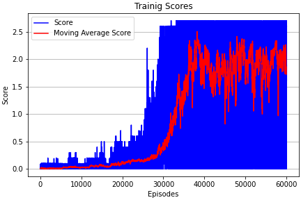

# Learning Algorithm

On this project two DDPG agents are trained using a shared experiences
buffer between them and each one have his own environment point of view

The learning algorism used on this project is the DDPG algorithms
described at the Continuous control with deep reinforcement learning
publication.

The implemented agent uses an Off-Line Actor-Critic algorithm that
follows an ϵ decay exploratory policy using the Ornstein-Uhlenbeck
stochastic process with µ equal to 0 as noise and target network softs
update.

The hyperparameters used on the training were

> ϵ-start: 1.0
>
> ϵ-end: 0.01
>
> ϵ-decay: 0.995
>
> γ: 0.999
>
> τ: 0.001

The Optimization algorithm used was Adam with a 0.0001 learn rate and
0.0 weights decay on the actor and the critic model.

The DDPG algorithm used and experience replay buffer with 1 million
samples, training on batches of 40 and soft update of target network's
parameters with τ equal to 0.001 every 20 episodes.

The Actor Deep Neural Network model selected is a forward 3 RELU layers
full connected network with 33 inputs from the Observation Space, 256
neurons on the fist layer, 128 on the second, 64 on the third and the
last output layer are 4 tanh to match the Action Space size and the
output dynamic range.

The Critic Deep Neural Network model selected is a forward 3 leaky RELU
layers full connected network with 33 inputs from the Observation Space,
256 neurons on the first layer, 128 neurons on the second but with 260
inputs, because to the 256 outputs from the previous layer the 4 states
from the actor are concatenated to from the 260 inputs on this layer, 64
on the third layer and the last output layer are 1 lineal used as Actor
training feedback.

# Plot of Rewards

The model takes around 20000 episodes to complete the training, but the
implemented algorithms wait for 60000 more episodes and 8 exploratory
retries to verify if is not more improves occurs on the last 100
episodes average.

Two computer trained one pair of agents each one and using the best trained model from
each computer, 100 episodes were executed on play mode in order to
verify the model's performance.

On the previous plot is possible view that agent have an average score
of 2.2489 over 100 episodes

# Ideas for Future Work

On this project would be interesting implement the multi-agent approach
using A3C, A2C, PPO or D4PG algorithms

Also implement the TNPG and TRPO algorism and compare all of them with
this DDPG implementation as base.
